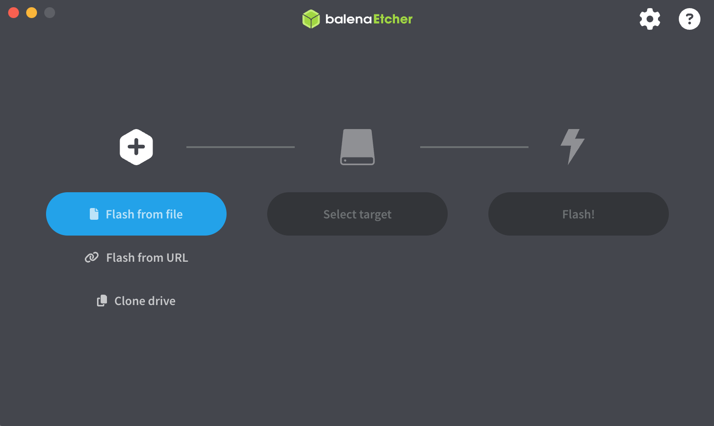
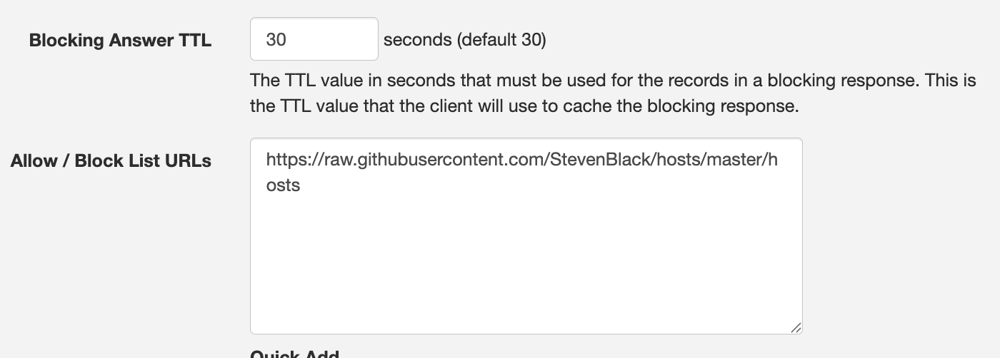
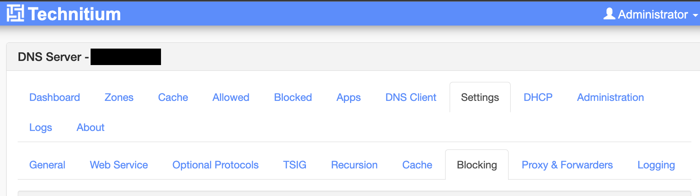
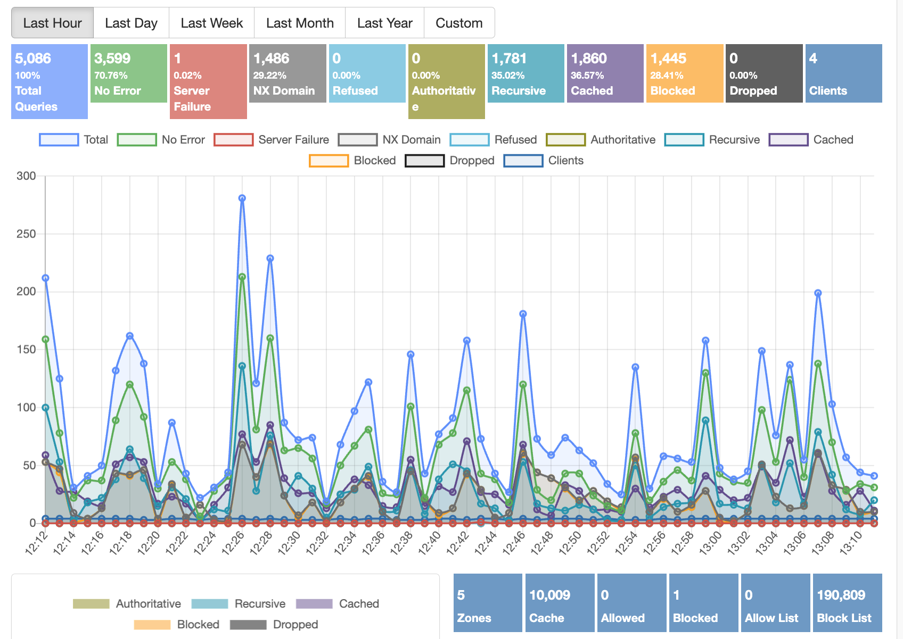

# Network-Level Ad Blocking

## A Beginner's Guide to Ad Blocking on Home Wi-fi 

Most ad blockers only work in a single browser on a single device. By contrast, DNS-level ad-blocking works at the network level. This means that every device on your network gets ad-blocking automatically, no browser extensions required.

This guide is meant to walk you through setting up a Ubuntu Linux server and installing Technitium. [Technitium](https://technitium.com/dns/) is a free, open-source, and easy-to-use DNS manager with built-in ad blocking functionality.

By the end, you'll have a self-hosted DNS server that blocks ads and trackers across your entire home network.

## How It Works

### What Is DNS?

Every time you visit a website, your computer has to look up the address of that site, like a number in a phonebook. This process is handled by a *DNS server*, or *Domain Name System server*. Your ISP assigns you one by default.

Ads and trackers are just websites. When a webpage tries to load an ad, your browser makes a covert, separate DNS request for the ad server's address. If your DNS server knows that address belongs to an advertiser, it can refuse to answer that request; as a result, the ad will never load.

Technitium DNS Server lets you do exactly that. It uses community-maintained "blocklists" of known ad and tracking domains to intercept and block ad DNS requests before they can even reach your browser.

!!! note

    See the [Glossary](#glossary) for definitions of technical terms.

### What Is a Server?

A *server* is a computer that runs continuously in the background, providing (or *serving*) some sort of service to other devices. Your server's job will be to answer DNS requests for every device on your network.

No special hardware is required for this. You can use any old laptop or desktop computer, as long as it allows you to install another operating system.

!!! note

    This guide uses Ubuntu Server 24.04 LTS. *LTS* stands for Long Term Support, meaning it receives security updates for five years. It's a safe choice for a home server that you plan to leave running 24/7.

---

## What You'll Need

- A computer to use as your server
- A USB flash drive of at least 4 GB
- A separate computer to download and prepare the installer
- A router you can log into

!!! warning

    Your server will need a *static IP address*. If its address changes, your router won't know where to send DNS requests. This guide covers how to set that up.

---

## Installing Ubuntu Server

### Downloading the Installer

On your main computer, go to [ubuntu.com/download/server](https://ubuntu.com/download/server) and download the Ubuntu Server 24.04 LTS ISO file. It's about 3.2 GB.

### Creating a Bootable USB Drive

To install Ubuntu Server, you need to transfer the ISO file onto a bootable USB drive. You can use [Balena Etcher](https://etcher.balena.io/) for this.

1. Open Balena Etcher.
2. Click **Flash from file** and select your downloaded ISO.
3. Click **Select target** and choose your USB drive.
4. Click **Flash**.



!!! warning

    **Etcher will erase everything on your USB drive. Make sure you've selected the correct drive.**

### Booting from USB

Plug the USB drive into your server computer and turn it on. You need to make it boot from the USB drive instead of its internal drive.

To do this, watch for a prompt during startup (usually something like **Press F12 for Boot Menu** or **Press DEL to enter Setup**). Press it repeatedly during the start-up process.

In the boot menu, select your USB drive. The Ubuntu Server installer will load.

!!! note

    If you're not sure which key to press, try repeatedly pressing ``F12, F2, F10,`` or ``DEL``.

### Running the Installer

The Ubuntu Server installer will take you through a series of steps.

1. **Language and keyboard:** Select your language and keyboard layout.

2. **Network:** Ubuntu will attempt to detect your network automatically. Leave this as-is for now.

3. **Storage:** When the installer asks about storage, choose **Use an entire disk** and confirm. This will erase the drive and install Ubuntu on it.

!!! warning

    Selecting **Use an entire disk** will permanently delete everything currently on that drive. **Make sure you're installing to the right drive.**

4. **Profile setup:** You'll be asked to create a username and password. Choose something secure, yet reasonably typable, as you'll be typing this regularly.

5. **SSH:** When asked, select **Install OpenSSH server**. This lets you connect to your server remotely from another computer instead of needing a keyboard and monitor plugged directly into the server. It's incredibly useful. 

6. **Snaps:** Skip these optional snap packages. You don't need any of them.

Confirm the installation and wait. When it finishes, remove the USB drive and let the server reboot.

---

## Interacting with Your Server

Once Ubuntu Server boots up, you'll be greeted with a plain text login screen. Ubuntu Server doesn't have a real GUI; everything is done through the command line.

You can log in directly by typing your username and pressing Enter, then entering your password.

Technically, you can type commands directly into your server. However, it is much more convenient to connect remotely using SSH, which lets you control your server from a different computer's terminal program. 

### Connecting via SSH

On **Windows 11**, open PowerShell or Terminal. On **Mac or Linux**, open Terminal. Then type:

```
ssh your-username@192.168.#.###
```

Replace `your-username` with the username you created during installation, and `192.168.#.###` with the IP address shown on your server's login screen.

!!! note

    Your server's current IP address is printed on screen when it boots, next to the words `eth0` or `enp`. It should look something like `192.168.#.###`.

Type `yes` if prompted to confirm the connection, then enter your password. Now you should be connected to your server via SSH.

!!! warning

    By default, your server accepts SSH connections using your username and password. However, if your network is ever exposed to the open internet, this creates a security risk. **Strongly consider disabling password authentication and switching to an SSH key-based login after you're done with this guide.** See the [Securing SSH](#ssh) section.

---

## Giving Your Server a Static IP Address

By default, most routers assign IP addresses dynamically, meaning that devices get a new one each time they connect. For a DNS server, this is a clear problem: if its IP address changes, nothing will be able to find it.

Therefore, you need to give your server a *static IP* that does not change; it remains static.

### Finding Your Current Network Info

In your server's terminal, type:

```
ip a
```

Look for a section starting with `eth0` or `enpXsX`. You'll see your current IP address listed next to `inet`. Write it down; you will need to reuse it a lot. 


Press ``ctrl + c`` to exit this view. Then type:

```
ip route
```

The line starting with `default via` shows your *gateway address*. This refers to your router's IP. Write this down as well.

### Editing the Network Config

Ubuntu Server uses a tool called *Netplan* to manage network settings. Its configuration lives in a file you'll edit directly.

Type:

```
ls /etc/netplan/
```

This shows you the filename of the config file. It usually looks like `00-installer-config.yaml`, though it may vary. Open it with:

```
sudo nano /etc/netplan/00-installer-config.yaml
```

`sudo` is short for "superuser do", which effectively means "run as administrator." `nano` is a simple text editor built into Ubuntu.

Replace the file's contents with the following, substituting in your own values:

```yaml
network:
  version: 2
  ethernets:
    enp4s0:
      dhcp4: no
      addresses:
        - 192.168.#.###/24
      routes:
        - to: default
          via: 192.168.#.#
      nameservers:
        addresses:
          - 1.1.1.1
          - 8.8.8.8
```

!!! note

    Replace `enp4s0` to match the interface name you found earlier (e.g., `enp3s0`, `eth0`). Replace `192.168.#.###` with the static IP address you want your server to keep permanently, and replace `192.168.#.#` with your router's gateway address. Keep `/24` at the end.

To save and exit nano: press `Ctrl + C`, press `Enter`, and press `Ctrl+ X`.

Apply the changes:

```
sudo netplan apply
```

!!! warning

    If you're connected via SSH when you apply this, your connection may drop—especially if the IP address changed. Reconnect using the new address. Again, the command to connect via SSH is ``ssh [server name]@192.168.#.##``.

---

## Installing Technitium DNS Server

Now that your server is stable and accessible, it's time to install Technitium, which will handle your DNS and ad blocking.

### Running the Installer

Technitium provides an install script. Run this command to download and execute it:

```
curl -sSL https://download.technitium.com/dns/install.sh | sudo bash
```
Alternatively, you can copy and paste the command directly from Technitium's site: https://technitium.com/dns/

`curl` means Client URL. It downloads a file from the internet. The `|` symbol (which is called a *pipe*) passes that file to `bash`, which then runs it as a script. The install script handles everything automatically.

!!! note

    This step requires your server to have an active internet connection. If anything fails, double-check your Netplan configuration from the previous step.

When the script finishes, Technitium DNS Server is up and running. The installer will confirm this with a success message.

### Accessing the Web Interface

Technitium has a web-based control panel. On any device on your network, open a browser and navigate to:

```
http://192.168.#.###:5380
```

Replace `192.168.#.###` with your server's static IP address.

You'll be prompted to create an admin username and password. Do that, then log in.

!!! warning

    For the sake of security, **do not use the same password you use for your server login or any other account.** Please create a separate credential for the Technitium web interface.

---

## Setting Up Ad Blocking

### Adding Blocklists

Technitium uses community-sourced *blocklists* full of known ad and tracking domains. When Technitium sees a DNS request for a domain on a blocklist, it blocks it.

In the Technitium web interface:

1. Click **Settings** in the top navigation bar.
2. Click the **Blocking** tab.
3. Under **Allow/Block List URLs**, click **Add**.
4. Paste in a blocklist URL. A reliable, well-maintained starting point is:

    ```
    https://raw.githubusercontent.com/StevenBlack/hosts/master/hosts
    ```

5. Click **Save**.





!!! note

    You can easily add many more blocking domain lists from the Quick Add dropdown. This dropdown contains lists of blockers for things like social media, fake news, pоrnography, and more.

### Applying the Blocklists

After saving your list URLs, scroll down and click **Save Settings**, then click **Flush Cache**, and press ``OK``.

Technitium will download and process your blocklists. This may take a minute. When it's done, the total number of blocked domains will be reflected in the web interface.

---

## Pointing Your Network to the New DNS Server

Adding blocklists only does anything if your devices are actually sending their DNS requests to Technitium. At this point, they're still using your ISP's DNS server by default.

The easiest way to change this for every device at once is to configure your router.

### Changing Your Router's DNS Settings

Log into your router's admin panel. This is usually accessible by going to ``192.168.1.1`` or ``192.168.0.1`` in a browser. Your router's default login details are often printed on a sticker placed on the device itself.

In your router's settings, find the field for **Primary DNS** and set it to your server's static IP address. You can leave **Secondary DNS** blank, or set it to a public DNS like `1.1.1.1` as a fallback in case your server is ever unavailable.

Save the settings and restart your router.

!!! info

    DHCP stands for Dynamic Host Configuration Protocol. It's the system your router uses to assign network configuration to devices when they connect. Part of that configuration is which DNS server to use. By changing the router's DHCP settings, you're telling every device on your network to use Technitium automatically.

Once your devices reconnect, they'll start routing DNS requests through your Technitium server. Ads should begin disappearing network-wide.

!!! warning

    If your router is locked down by your ISP and does *not* allow you to change its DNS settings, you'll have to individually change the DNS server on each of your home devices to use your ``192.168.#.#`` server. 

### Verifying Functionality

In the Technitium web interface, click the **Dashboard** tab. As devices on your network browse the internet, you should start seeing DNS query activity appear here, including a count of blocked requests.



!!! note

    It may take a few minutes after the router restarts before you see traffic. If nothing appears after ten minutes, double-check that your router's DNS field is set to your server's static IP, and that your server is reachable at that address.

---

## Keeping Things Running

### Technitium Starts Automatically

Technitium is installed as a *system service*, meaning it starts automatically when your server boots. You don't need to do anything special to keep it running.

### Restarting Technitium

If you ever need to restart the DNS service manually, run this on your server:

```
sudo systemctl restart dns.service
```

To check whether it's running:

```
sudo systemctl status dns.service
```

!!! info

    `systemctl` is Ubuntu's service manager. It's how you start, stop, restart, and check the status of background services like Technitium.


<a id="ssh"></a>

## Securing SSH (Recommended)

By default, your server accepts SSH logins using a password. Switching to *key-based authentication* is more secure and worth doing before anything else.

### Step 1: Generate a Key Pair

On your **main computer** (not the server), run:

​```
ssh-keygen -t ed25519
​```
!!! note
    Ed25519 is a recommended crytographic algorithm for SSH keys. 

Press ``Enter`` through the prompts to accept the defaults. This creates two files: a private key (for your machine) and a public key (for your server).

### Step 2: Copy Your Public Key to the Server

​```
ssh-copy-id your-username@192.168.#.###
​```

Enter your password when prompted.

### Step 3: Disable Password Login

On the server, open the SSH config:

​```
sudo nano /etc/ssh/sshd_config
​```

Find `#PasswordAuthentication yes` and change it to:

​```
PasswordAuthentication no
​```

Save and exit with ```ctrl + c```, `Enter`, and `ctrl + x`, then restart SSH:

!!! warning

    Before disabling password login, open a second SSH session to that confirm key-based login works. If you lock yourself out, you'll need physical access to the server to recover.

​```
sudo systemctl restart ssh
​```

<a id="glossary"></a>
## Glossary

**Blocklist**
— A list of known ad, tracking, or malicious domains. Technitium uses blocklists to decide which DNS requests to block.

**DHCP**
— Dynamic Host Configuration Protocol. The system your router uses to automatically assign IP addresses and other network settings to devices when they connect.

**DNS**
— Domain Name System. The internet's address book—translates human-readable website names like `google.com` into the numerical IP addresses that computers actually use.

**DNS Server**
— A server that answers DNS requests. By default, your ISP provides one. This guide replaces that with your own.

**Gateway**
— Your router's IP address, as seen from inside your network. Traffic that needs to leave your local network is sent to the gateway first.

**IP Address**
— A numerical label assigned to each device on a network. On most home networks, addresses look like `192.168.1.x`.

**ISO**
— A file format for disk images. An ISO file contains everything needed to install an operating system.

**ISP**
— A telecommunications company that provides access to the internet and other similar services. 

**Netplan**
— Ubuntu's network configuration tool. It reads a YAML file and applies network settings, including static IP addresses.

**SSH**
— Secure Shell. A protocol for connecting to and controlling a remote computer securely over a network.

**Static IP**
— An IP address that doesn't change. Required for a server so that other devices can reliably find it.

**sudo**
— A command prefix that runs a command with administrator privileges. Short for "superuser do."

**systemctl**
— Ubuntu's service manager. Used to start, stop, restart, and check the status of background services.