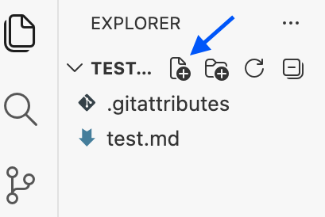
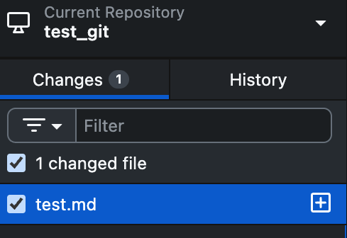
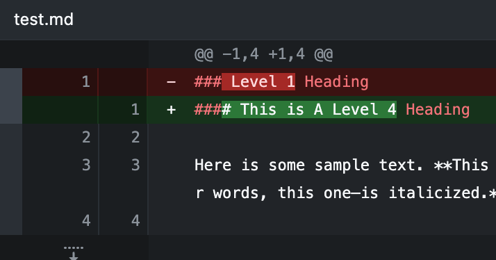
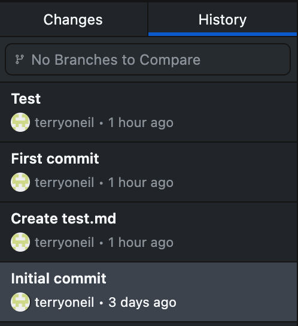

# Git for Writers

By the end of this guide, you'll have a GitHub account, a local repo, and a sample Markdown file tracked with version control.

Git is an extremely useful version control tool. It may look intimidating to non-developers, but it's actually pretty simple. It's an essential piece of any collaborative writing workflow.

Oftentimes people work with Git purely through command line terminals. While this is  efficient and practical for coders, it's not necessary for writers. It's easier to work in something that has a GUI, like Github Desktop.

## What Does Git Actually Do?

Git is a version control tool. It keeps track of every different version that you save of a file. In Git, everything revolves around a *repository*, or *repo*, which is just a folder tracked by Git. Using Git, you can easily track changes and collaborate with other people through forking, merging, branching, and pulling.

!!! note

    See the [Glossary](#Glossary) for definitions of all these Git-specific terms. 

## What is Markdown?

Markdown is a plain text formatting syntax that can easily be converted to HTML. It was developed to be more readable and easier to write in than HTML.

## Installing GitHub Desktop and a Text Editor

### GitHub

To begin, create a [Github Account](https://github.com/) and then download [GitHub Desktop](https://github.com/apps/desktop).


### Text Editor

To edit Markdown files, you will use [Visual Studio Code](https://code.visualstudio.com/), or *VS Code*. Install it.

!!! Note
    Microsoft's Visual Studio Code is one of the most popular tools for writing documentation. However, there are plenty of other options like Typora, Obsidian, and Ulysses.

## Local vs. Remote Repositories

When working with GitHub, you'll be working with a local version of a repository, as well as a remote version. The *remote* version refers to the repository that can be found on the GitHub website, while the *local* version refers to the folder structure kept on your device.

## Creating Your First Repo

Open GitHub Desktop and sign in with your GitHub account. The program walks you through the process of creating and connecting a repo on your operating system.

## Making Your First Markdown File

Go into GitHub Desktop, right-click on your repo, and select Open in Visual Studio Code. 

You can also open your repo through VS Code by going to ``File -> Open Folder`` and selecting the location of your GitHub repo on your device. 

Once you're in VS Code, open the Explorer tab and click the New File button. Create a file called *test.md*.



Try copying and pasting the following sample markdown template:

!!! example
    ```
    # Level 1 Heading

    Here is some sample text. **This sentence is bolded.** *The following sentence—in other words, this one—is italicized.* ***This one combines both emphasis techniques.*** 

    ## Level 2 Heading 

    > Here is a blockquote!
    >
    >> And another, nested!

    ### Level 3 Heading

    1. Markdown automatically handles ordered (numbered) lists.
    1. You don't actually need to keep track.
    1. Notice how this list, in the code, consists only of the number 1
    1. And yet, when all is said and done, it renders as a proper numbered list.

    - By contrast,
    - This is an unordered (bulleted) list.

    This is a hyperlink to [Google](https://google.com "And this is the link's tooltip.").
    <This is a direct link.>

    #### Image Insertion 

    

    This is a photo of the author's cat.
    ```
Save your file and press `ctrl/cmd + shift + v` to open up a markdown preview tab in VS Code. This will let you see your markdown text rendered into HTML, allowing you to preview changes.
If everything worked correctly, there will be a photo of a cat at the bottom of the preview.

!!! note
    If `ctrl/cmd + shift + v` doesn't open a preview, make sure your *test.md* file is open and active in the editor. Markdown preview is built into VS Code and requires no additional extensions.

## Making A Local Commit

Save your markdown file and open GitHub Desktop. Click the checkmark on *test.md* to stage it. Write a summary to describe your changes, then press *Commit file to main.* You've just made a local commit.



!!! note
    If your *сommit* button is greyed out, you haven't written a summary yet. Summary is a required field. 

Making a lоcal commit is like saving your progress in a video game; it's a useful safety net. Use the summary and description boxes to provide additional context. This will make it easy to know which commit to revert to if necessary.

## Tracking Changes 

In VS Code, within *test.md*, delete the first level 1 heading. Replace it with a level 4 heading.

```
#### This is A Level 4 Heading
```

Save your file and look in GitHub Desktop. Notice how Git simply tracks edits by highlighting them in red and green. It tracks line-level deletions and insertions, which is traditionally very useful for tracking changes to code, but is also highly applicable for technical writing and documentation. 



!!! note
    If you don't see any changes highlighted in GitHub Desktop at this point, you may not have saved your *test.md* file in VS Code.

### Pushing Changes

Stage *test.md* and commit it to main. Press *Push Origin*. 

!!! note
    If your Push Origin button is greyed out, there is nothing new to push. You need to make a commit first.

Now your changes have been pushed to the main version. 

!!! info
    *Origin* is Git's way of referring to the location a repo originally came from. When you Push Origin, you're pushing your local commits onto the original repo. 

### Reverting Changes

To undo a commit in GitHub Desktop, go to History to reveal a timestamped list of all your commits. From here, you may right-click a commit and press ``Revert changes in commit``.



## Collaborating in GitHub

### Pulling

In a collaborative setting, you'd want to be sure to pull a repo before working on anything, to ensure that your copy is up to date. 

To pull, press the *Fetch origin* button or go to ``Repository -> Pull``.

!!! info
    Fetch origin will check for changes, but it won't automatically download them. If there are changes, you'll have to click again to pull them.

### Branching

When you intend on doing something substantial or experimental (like restructuring a document), you'd want to create a branch and then work from there, only merging to main once you're satisfied with the results. 

To create a branch, go to ``Branch -> New Branch``.
To merge, go to ``Branch -> Merge into Current Branch``. 


## Glossary

**Branch**
— A separate copy of a project you can work on without affecting the main version. A branch is like a draft. 

**Clone**
— To download a copy of a repo to your local device, so you can edit it without affecting the original.

**Commit**
— A saved snapshot of changes with a message describing what changed.

**Fork**
— A personal copy of somebody else's GitHub repository.

**Local Commit**
— A cоmmit that isn't pushed to the main branch. It lives only on your local device.

**Markdown**
— A markup language for writing, like HTML. Markdown files use the **.md** extension.

**Merge**
– To combine changes from one branch into another, to eventually be merged into the main version.

**Pull**
— To download the latest changes from a GitHub repo to a local device. If someone else has pushed changes since your last sync, рulling will bring those changes to your local copy.

**Push**
— To upload your local commits to the GitHub repository, making your changes visible to collaborators and syncing your local version with the remote.

**Repo**
— A folder tracked by Git containing all of a project's files and their full history. Shortened form of *repository*.

**Stage**
— To select a changed file to include in the next cоmmit. Staging allows you select only the files you want to cоmmit, instead of committing everything at once.

**Syntax**
– The set of formal rules that defines the structure and format of a coding or markup language. Syntax is the "grammar" of coding languages.